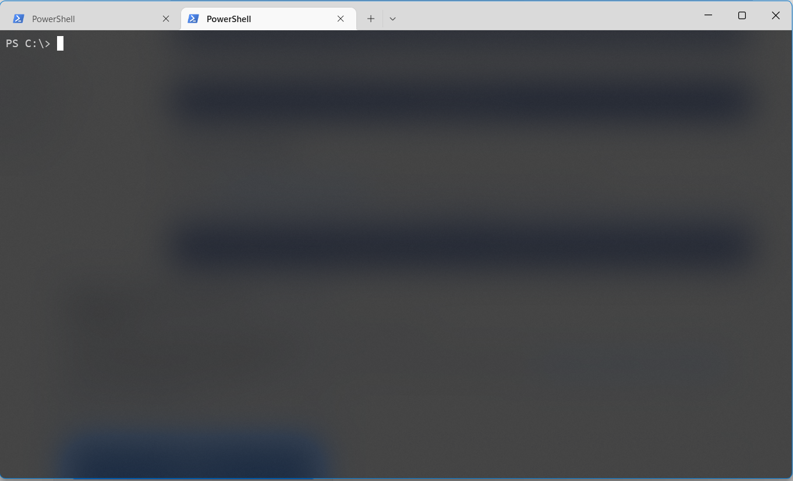
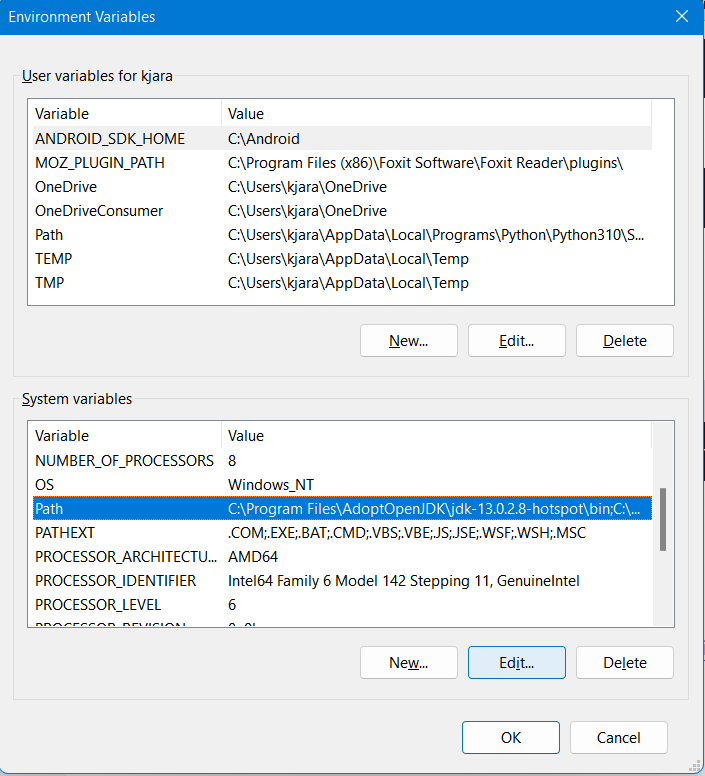

# Windows Development

I happen to do a lot of windows development on many systems.
This is a central source of information for installing and getting started with some of the developmental tools for windows. This is primarily for `Python` and `C/C++` development.

> **Note** <br>
> All of the following code blocks are shell commands which should be entered into a terminal.

## Installing Windows Terminal

This is an optional step. Windows terminal is a very clean and nice terminal interface. It will work with a variety of shells (Powershell, Command Prompt, Git Bash, WSL, etc.).
<br>
Windows terminal can be found on the [Microsoft website](https://docs.microsoft.com/en-us/windows/terminal/install)


## Installing Git

Installer is available at the [Git website](https://git-scm.com/book/en/v2/Getting-Started-Installing-Git)
<br>

1. Go through installer and **Install for all users**.

2. Add the Git bin folder to the system path.

   > If standard install git program is located at:
   > <br> `C:\Program Files\Git\bin`

   

3. Open a terminal and check to see if git is installed and added to the path with the following command.
   ```
   git --version
   ```

## Installing Python

1. Python and its installer is avaiable on the [Python website](https://www.python.org/downloads/windows/). Choose the lastest installer for **Python3** download the 64 bit installer.
   When prompted chose **Add Python to Path**
2. Verify Python is installed and added to the path.
   <br>
   There are a variety of python aliases verify by using one of the following commands. By default it is usually the first alias.
   ```
   py --version
   ```
   or
   ```
   python --version
   ```
   or
   ```
   python3 --version
   ```
3. Install and upgrade `Pip` the python package manager.
   <br>
   ```
   pip3 --version
   ```
   To upgrade pip use the following:
   ```
   pip3 install --upgrade pip
   ```
   Install some basic python packages like the following example
   ```
   pip3 install numpy
   ```

## Installing Pacman

Pacman is a basic package manager.
<br>
This is provided by the [MSYS2 Website](https://www.msys2.org/).

1.  Download the installer and follow the instructions. Download the **64 bit version**.
2.  Add the bin files to the system path. This is similar to adding `git` to the path.

    > If standard install bin folder is located at
    > <br> `C:\msys64\usr\bin`

3.  Open a terminal and verify pacman is installed and added to path.
    ```
    pacman --version
    ```

## Installing C/C++ compilers

For `C` and `C++` development you need the `g++` and `gcc` compilers.

1.  Installing `gcc`
    ```
    pacman -S gcc
    ```
    Verify it is added to the path with:
    ```
    gcc --version
    ```
2.  Installing `g++`

    ```
    pacman -S g++
    ```

    Verify it is added to the path with:

    ```
    g++ --version
    ```

3.  Installing `gdb` (the debugger)
    ```
    pacman -S gdb
    ```
    Verify it is added to the path with:
    ```
    gdb --version
    ```
4.  Installing `make`. (A tool for making large c++ and c programs)

    > It can probably be installed using `pacman` but I have never done so.

    Installing via `winget` (the default windows package manager).

    ```
    Winget install GnuWin32.make
    ```

    Add make to the System Path variable (same as adding git to the path).

    > If normal install make binary file is located at
    > <br> `C:\Program Files (x86)\GnuWin32\bin`

    Verify make is added to path with:

    ```
    make --version
    ```

## Installing Vim

Vim is a text editor.
<br>
If pacman is installed use the following command:

```
pacman -Ss vim
```

Verify vim is added to path with:

```
vim --version
```
